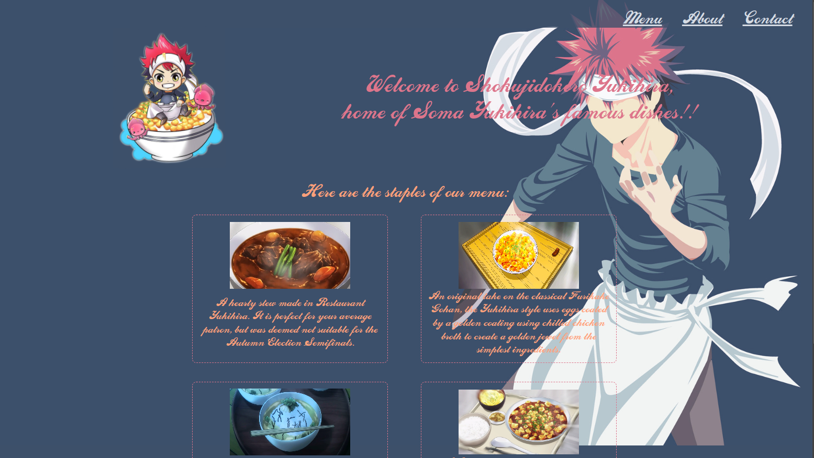

# Yukihira Eatery



## Summary

**Hosted:** [Yukihira Eatery Screenshot](https://blurryq.github.io/restaurant-page/)

Welcome to the Yukihira Eatery, inspired by the anime [Food Wars](https://shokugekinosoma.fandom.com/wiki/Shokugeki_no_Soma). This project was built to deepen my understanding of modern front-end development practices, including npm workflow, organizing src and dist folders, and applying JavaScript concepts to create an interactive, dynamic user experience.

## Setup

To get started with this project, follow the steps below:

### 1. For the Repository

First you need to fork this repo to your GitHub account by clicking fork button near the top right of this page. If you are unfamiliar with this then please follow this GitHub [guide](https://docs.github.com/en/pull-requests/collaborating-with-pull-requests/working-with-forks/fork-a-repo).

### 2. Clone the Repository

The next step is cloning this to your local device using the follwoing command, changing the "your-username" to your GitHub username:

```
git clone github.com/your-username/nc-news
```

### 4. Install Dependencies

Now this has been done install all the npm dependencies by running the following command in your terminal/ cli:

```
npm install
```

### 5. Install Dependencies

Once this has installed you can type the following into terminal to run the project.

```
npm run dev
```

### Key Skills:

1. **DOM Manipulation with JavaScript**  
   I dynamically created and modified HTML elements using `document.createElement` and `appendChild`, allowing the web pages to be built dynamically rather than relying on static HTML.

2. **Modular JavaScript**  
   Functions like `renderMenuPage`, `renderContactPage`, and `renderAboutPage` were developed as reusable modules, promoting a maintainable and scalable code structure.

3. **Event Handling**  
   Event listeners were added to key navigation elements, such as "menu" and "about," to trigger dynamic content updates, demonstrating my understanding of how to respond to user interactions.

4. **Responsive Design**  
   The `renderNavAndLogo` function adjusts the logo size based on screen width, showcasing my grasp of responsive design principles.

5. **CSS Integration**  
   By importing and dynamically applying CSS classes through JavaScript, I effectively integrated styles into the project, ensuring the content is visually structured and styled appropriately.

6. **Content Structuring and Layout**  
   The use of semantic HTML elements and a clear content hierarchy ensures that the website remains readable, maintainable, and well-organized.

7. **Fictional/Concept-Based Content Creation**  
   Drawing inspiration from _Shokugeki no Soma_, the project showcases creativity in translating a concept into a user-interactive experience, blending coding skills with thematic content.
